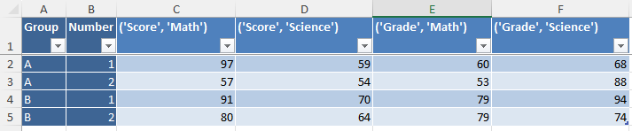

# pandabook

## Data Export:

* Export a collection of pandas dataframes to an Excel workbook with advanced styling options.
* Handles arbitrary data types, like lists, dictionaries, uuid etc.
* Handles multi-level indexes
* Can do conditional formatting based on values, row-specific styling, etc.


    

    

    


## Data Import:

* You can also load a collection of named tables from an Excel file back to dataframes.

    


## Setup instructions

### 1. Clone the repository

```bash
git clone <repository-url>
```

### 2. Install dependencies

This project uses [`uv`](https://github.com/astral-sh/uv) for dependency management. Make sure `uv` is installed on your system.

To install dependencies:

```bash
uv venv
uv pip install .
```
To activate the virtual environment:
```bash
.venv\Scripts\activate
```
After this you can run the Jupyter notebook to see worked examples.

## More info:

[Refer to example.ipynb for worked examples.](example.ipynb)
